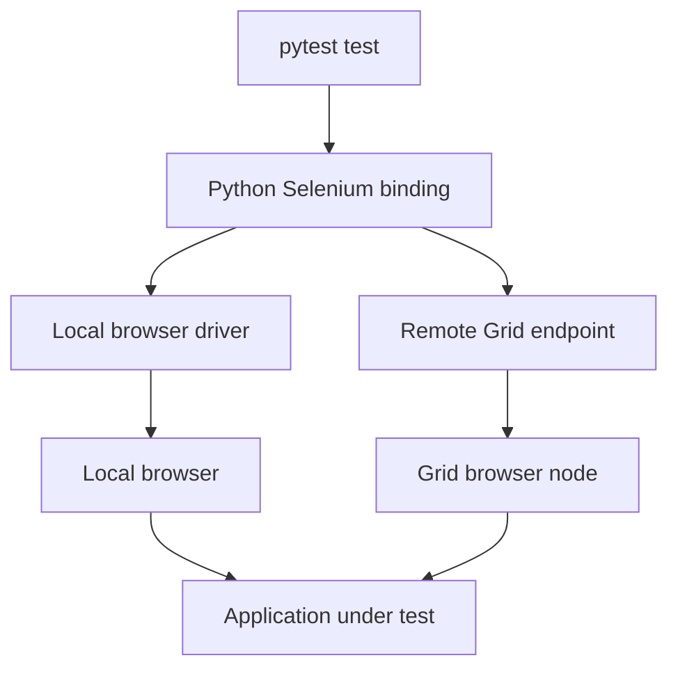

# Selenium: From Browser Automation to CI/CD

A practical guide for software, QA automation, DevOps, and SRE engineers. Learn browser automation with **Selenium 4, Python, and pytest**, then organize tests with Page Objects and run them locally or through Selenium Grid.

**One-file guide:** All example files are included below. Upload this document as `README.md` in your repository. Create the listed Python, HTML, and configuration files locally when practising.

> **Scope:** A broad learning reference, not every Selenium API. Python is the main language; the concepts also apply to other official bindings. Examples use current Selenium 4-style APIs. Install mutually compatible Python, package, browser, and driver versions, then pin your tested environment. Documentation was checked on 5 October 2026. Python/shell syntax and Markdown navigation were checked; browser, Grid, and Jenkins execution were not tested in the authoring environment.

## Contents

1. [What Selenium does](#1-what-selenium-does)
2. [Architecture and components](#2-architecture-and-components)
3. [Setup and driver management](#3-setup-and-driver-management)
4. [Your first browser script](#4-your-first-browser-script)
5. [Locators](#5-locators)
6. [Element interactions and assertions](#6-element-interactions-and-assertions)
7. [Waits and synchronization](#7-waits-and-synchronization)
8. [Complete pytest project](#8-complete-pytest-project)
9. [Page Object Model](#9-page-object-model)
10. [Test selection and parametrization](#10-test-selection-and-parametrization)
11. [Dropdowns, keyboard, and mouse](#11-dropdowns-keyboard-and-mouse)
12. [Alerts, frames, windows, and tabs](#12-alerts-frames-windows-and-tabs)
13. [Shadow DOM and JavaScript](#13-shadow-dom-and-javascript)
14. [Uploads and downloads](#14-uploads-and-downloads)
15. [Cookies, authentication, and test data](#15-cookies-authentication-and-test-data)
16. [Headless and cross-browser execution](#16-headless-and-cross-browser-execution)
17. [Screenshots and reporting](#17-screenshots-and-reporting)
18. [Selenium Grid and Docker](#18-selenium-grid-and-docker)
19. [Parallel execution](#19-parallel-execution)
20. [Jenkins pipeline](#20-jenkins-pipeline)
21. [WebDriver BiDi](#21-webdriver-bidi)
22. [Troubleshooting](#22-troubleshooting)
23. [Reliable test design](#23-reliable-test-design)
24. [Command and API reference](#24-command-and-api-reference)
25. [Interview questions](#25-interview-questions)
26. [Learning exercises](#26-learning-exercises)
27. [Official references](#27-official-references)

## 1. What Selenium does

Selenium automates real web browsers. A script can navigate to a page, find elements, type, click, and inspect the resulting state. A test framework adds assertions, fixtures, test discovery, reports, and exit codes.

Use Selenium for important browser workflows such as login, checkout, administration, or compatibility checks across supported browsers. Keep most pure business-logic tests at unit/API level, where failures are usually faster to diagnose.

| Need | Appropriate layer |
|---|---|
| Verify a user can complete a browser workflow | Selenium plus a test framework |
| Validate a REST response directly | HTTP/API test tooling |
| Load-test thousands of concurrent requests | Dedicated performance tooling |
| Automate a native desktop application | Desktop-specific automation |
| Test native mobile applications | A mobile automation stack, often Appium |
| Validate every accessibility requirement | Dedicated checks plus manual evaluation |

Selenium is not a compiler, deployment tool, or test runner by itself. Browser automation should target systems you own or are authorized to test.

## 2. Architecture and components

| Component | Role |
|---|---|
| Selenium WebDriver | Browser automation APIs and bindings |
| Language binding | Python/Java/JavaScript/etc. client library |
| Browser driver | Browser-specific WebDriver implementation |
| Selenium Manager | Helps resolve/download compatible drivers and supported browsers |
| Selenium Grid | Routes remote sessions to available browser capacity |
| Selenium IDE | Recording/playback tooling for supported environments |
| pytest | Python test collection, fixtures, assertions, and reporting |



Classic WebDriver sends commands and receives responses. WebDriver BiDi adds bidirectional communication and event-oriented capabilities. Browser and binding support varies by feature.

## 3. Setup and driver management

### Prerequisites

Use a Python version supported by your selected Selenium and pytest releases, a virtual environment, and Chrome, Firefox, or Edge. Install browsers through their official distribution method. For Linux CI, include the browser's OS libraries and fonts.

```bash
mkdir selenium-demo
cd selenium-demo
python3 -m venv .venv
source .venv/bin/activate
python -m pip install --upgrade pip
python -m pip install 'selenium>=4,<5' pytest pytest-xdist
python -c "import selenium; print(selenium.__version__)"
python -m pytest --version
```

Windows PowerShell activation is `.venv\Scripts\Activate.ps1`; installation policy and Python launcher usage may differ.

### Selenium Manager

For ordinary local setup, start with `webdriver.Chrome()` or the equivalent Firefox/Edge constructor. Selenium can use Selenium Manager when driver management is needed. You generally do not need a separate third-party driver-manager package.

Initial resolution/downloads may need internet access. Corporate proxy, certificates, cache permissions, and offline environments need deliberate configuration. Do not assume every CI agent can fetch binaries dynamically.

If your organization supplies an approved driver explicitly:

```python
from selenium import webdriver
from selenium.webdriver.chrome.service import Service

service = Service(executable_path="/approved/path/chromedriver")
driver = webdriver.Chrome(service=service)
try:
    print(driver.capabilities.get("browserVersion"))
finally:
    driver.quit()
```

That path is a placeholder. The driver must be executable and compatible with the actual browser. Modern Selenium uses a `Service` object rather than the old `executable_path` constructor pattern.

### Pin a known working environment

After validating the lab in a clean virtual environment:

```bash
python -m pip freeze > requirements.lock.txt
```

Commit and review the lock file for repeatable installs. Browser and Grid image versions need their own control; a Python lock file does not pin them.

## 4. Your first browser script

Create `first_test.py`. This example uses a tiny embedded HTML page, so it does not depend on an external website:

```python
from urllib.parse import quote
from selenium import webdriver
from selenium.webdriver.common.by import By

html = """<!doctype html>
<title>Selenium starter</title>
<label for="name">Name</label><input id="name">
"""

driver = webdriver.Chrome()
try:
    driver.get("data:text/html;charset=utf-8," + quote(html))
    assert driver.title == "Selenium starter"
    field = driver.find_element(By.ID, "name")
    field.send_keys("Hemant")
    assert field.get_property("value") == "Hemant"
finally:
    driver.quit()
```

```bash
python first_test.py
```

Use `quit()` to end the entire WebDriver session. `close()` only closes the current window and is not a substitute for session cleanup. A script printing a page title is automation; assertions make the expected behavior explicit.

## 5. Locators

A locator identifies an element in the current document/search context.

| Strategy | Example |
|---|---|
| ID | `By.ID, "name"` |
| Name | `By.NAME, "email"` |
| CSS | `By.CSS_SELECTOR, '[data-testid="save"]'` |
| XPath | `By.XPATH, '//button[normalize-space()="Save"]'` |
| Link text | `By.LINK_TEXT, "Account"` |
| Partial link text | `By.PARTIAL_LINK_TEXT, "Account"` |
| Tag name | `By.TAG_NAME, "button"` |
| Class name | `By.CLASS_NAME, "notice"` |

Prefer stable, unique identifiers or application-owned test attributes. `data-testid` is a convention you establish with developers; Selenium does not create it automatically.

Avoid absolute XPath chains and position-based selectors when semantic identifiers exist. `By.CLASS_NAME` accepts one class token, not a string of several classes. CSS can express multiple classes with `.button.primary`.

`find_element()` returns one match or raises an exception. `find_elements()` returns a list, which can be empty. Scope searches to a component where possible to avoid matching a duplicate button elsewhere.

## 6. Element interactions and assertions

The following fragments assume an existing `driver`, imported `By`, and matching elements in your application. They are patterns, not extra controls included in the minimal lab.

```python
field = driver.find_element(By.ID, "email")
field.clear()
field.send_keys("test@example.invalid")
assert field.get_property("value") == "test@example.invalid"

button = driver.find_element(By.CSS_SELECTOR, '[data-testid="save"]')
assert button.is_enabled()
button.click()
```

| API | Meaning |
|---|---|
| `.text` | Rendered element text |
| `.get_property("value")` | Current DOM property value |
| `.get_dom_attribute("value")` | DOM attribute value |
| `.is_displayed()` | Whether Selenium considers the element displayed |
| `.is_enabled()` | Enabled state |
| `.is_selected()` | Selection state of applicable controls |
| `.clear()` / `.send_keys()` | Edit a compatible input |
| `.click()` | Perform a WebDriver click |

Assert meaningful outcomes after actions: a saved record, visible confirmation, or navigation to the expected state. A successful click call does not prove the application operation succeeded.

## 7. Waits and synchronization

Modern pages update after the initial document load. Synchronize with observable state instead of fixed sleeps.

```python
from selenium.webdriver.common.by import By
from selenium.webdriver.support.ui import WebDriverWait
from selenium.webdriver.support import expected_conditions as EC

wait = WebDriverWait(driver, 10)
button = wait.until(
    EC.element_to_be_clickable((By.CSS_SELECTOR, '[data-testid="save"]'))
)
button.click()
wait.until(EC.text_to_be_present_in_element((By.ID, "status"), "Saved"))
```

| Wait | Purpose |
|---|---|
| Implicit wait | Session-wide polling behavior for element lookup |
| Explicit wait | Poll a specific expected condition |
| Page-load timeout | Bound navigation waiting under the selected loading strategy |
| Script timeout | Bound asynchronous script execution |

Avoid mixing implicit and explicit waits: timing becomes difficult to predict. This guide keeps implicit wait at zero.

Presence is not visibility, and visibility is not guaranteed interactability. `element_to_be_clickable` checks visibility/enabled state, but a later overlay or DOM change can still intercept a click. Wait for overlays to disappear where appropriate.

`time.sleep()` always consumes its duration and can still be too short. Use it only for a deliberate non-synchronization reason, not as the foundation of a test suite.

## 8. Complete pytest project

Create these files in `selenium-demo`. The HTML page intentionally delays its result to demonstrate explicit waits.

| File | Purpose |
|---|---|
| `demo/index.html` | Local application fixture |
| `conftest.py` | Local server, browser fixture, failure artifacts |
| `pages/__init__.py` | Empty file marking the page package |
| `pages/greeting_page.py` | Page Object |
| `tests/test_greeting.py` | Parametrized browser test |
| `pytest.ini` | Discovery and marker configuration |
| `requirements.txt` | Initial dependency constraints |
| `.gitignore` | Exclude local/runtime artifacts |

### requirements.txt

```text
selenium>=4,<5
pytest
pytest-xdist
```

These bootstrap constraints are intentionally not a tested exact-version lock. Generate `requirements.lock.txt` after validating compatible versions.

### demo/index.html

```html
<!doctype html>
<html lang="en">
<head>
  <meta charset="utf-8">
  <meta name="viewport" content="width=device-width, initial-scale=1">
  <title>Selenium greeting lab</title>
</head>
<body>
  <h1>Greeting form</h1>
  <form id="greeting-form">
    <label for="name">Your name</label>
    <input id="name" name="name" required>
    <button id="submit" type="submit" data-testid="greet">Greet</button>
  </form>
  <p id="message" role="status" aria-live="polite"></p>
  <script>
    const form = document.querySelector('#greeting-form');
    const field = document.querySelector('#name');
    const button = document.querySelector('#submit');
    const message = document.querySelector('#message');
    form.addEventListener('submit', (event) => {
      event.preventDefault();
      const name = field.value.trim();
      button.disabled = true;
      message.textContent = '';
      setTimeout(() => {
        message.textContent = name ? `Hello, ${name}!` : 'Please enter a name.';
        button.disabled = false;
      }, 300);
    });
  </script>
</body>
</html>
```

### conftest.py

```python
import hashlib
import logging
import os
import threading
import time
from functools import partial
from http.server import SimpleHTTPRequestHandler, ThreadingHTTPServer
from pathlib import Path

import pytest
from selenium import webdriver


@pytest.fixture(scope="session")
def base_url():
    configured = os.getenv("BASE_URL")
    if configured:
        yield configured.rstrip("/")
        return
    if os.getenv("REMOTE_URL"):
        raise RuntimeError("Remote browsers require a reachable BASE_URL")

    demo_dir = Path(__file__).resolve().parent / "demo"
    handler = partial(SimpleHTTPRequestHandler, directory=str(demo_dir))
    server = ThreadingHTTPServer(("127.0.0.1", 0), handler)
    thread = threading.Thread(target=server.serve_forever, daemon=True)
    thread.start()
    try:
        yield f"http://127.0.0.1:{server.server_port}"
    finally:
        server.shutdown()
        server.server_close()
        thread.join()


@pytest.hookimpl(hookwrapper=True)
def pytest_runtest_makereport(item, call):
    outcome = yield
    report = outcome.get_result()
    setattr(item, f"rep_{report.when}", report)


@pytest.fixture
def driver(request, base_url):
    # Depending on base_url validates/starts the app before opening a browser.
    browser = os.getenv("BROWSER", "chrome").lower()
    headless = os.getenv("HEADLESS", "1") == "1"
    remote_url = os.getenv("REMOTE_URL")

    if browser == "chrome":
        options = webdriver.ChromeOptions()
        if headless:
            options.add_argument("--headless")
        constructor = webdriver.Chrome
    elif browser == "firefox":
        options = webdriver.FirefoxOptions()
        if headless:
            options.add_argument("-headless")
        constructor = webdriver.Firefox
    elif browser == "edge":
        options = webdriver.EdgeOptions()
        if headless:
            options.add_argument("--headless")
        constructor = webdriver.Edge
    else:
        raise ValueError(f"Unsupported BROWSER: {browser}")

    session = (
        webdriver.Remote(command_executor=remote_url, options=options)
        if remote_url else constructor(options=options)
    )
    try:
        session.implicitly_wait(0)
        session.set_page_load_timeout(30)
        session.set_script_timeout(10)
        session.set_window_size(1440, 1000)
        yield session
    finally:
        report = getattr(request.node, "rep_call", None)
        if report is not None and report.failed:
            try:
                output = Path("artifacts")
                output.mkdir(exist_ok=True)
                test_id = hashlib.sha256(request.node.nodeid.encode()).hexdigest()[:12]
                stem = output / f"{test_id}-{time.time_ns()}"
                session.save_screenshot(str(stem) + ".png")
                Path(str(stem) + ".html").write_text(
                    session.page_source, encoding="utf-8"
                )
            except Exception:
                logging.exception("Could not capture browser failure artifacts")
        session.quit()
```

Each test gets a fresh browser session. Each pytest process starts its own local server on a free port unless `BASE_URL` is supplied. Artifacts are captured for test-call failures when the session is still usable; startup or teardown failures may not produce screenshots.

### pages/greeting_page.py

```python
from selenium.webdriver.common.by import By
from selenium.webdriver.support.ui import WebDriverWait
from selenium.webdriver.support import expected_conditions as EC


class GreetingPage:
    NAME = (By.ID, "name")
    SUBMIT = (By.CSS_SELECTOR, '[data-testid="greet"]')
    MESSAGE = (By.ID, "message")

    def __init__(self, driver, base_url):
        self.driver = driver
        self.base_url = base_url
        self.wait = WebDriverWait(driver, 10)

    def open(self):
        self.driver.get(self.base_url + "/index.html")
        self.wait.until(EC.visibility_of_element_located(self.NAME))
        return self

    def greet(self, name):
        field = self.wait.until(EC.visibility_of_element_located(self.NAME))
        field.clear()
        field.send_keys(name)
        self.wait.until(EC.element_to_be_clickable(self.SUBMIT)).click()
        return self.wait.until(
            lambda browser: browser.find_element(*self.MESSAGE).text or False
        )
```

Create an empty `pages/__init__.py` as well.

### tests/test_greeting.py

```python
import pytest
from pages.greeting_page import GreetingPage


@pytest.mark.smoke
@pytest.mark.parametrize("name", ["Hemant", "Platform Team"])
def test_greeting(driver, base_url, name):
    page = GreetingPage(driver, base_url).open()
    actual = page.greet(name)
    assert actual == f"Hello, {name}!"
```

### pytest.ini

```ini
[pytest]
testpaths = tests
addopts = -ra --strict-markers
markers =
    smoke: essential browser workflows
```

### .gitignore

```gitignore
.venv/
__pycache__/
.pytest_cache/
artifacts/
.env
```

### Run the suite

From the project root with the virtual environment active:

```bash
python -m pip install -r requirements.txt
python -m pytest -q
HEADLESS=0 python -m pytest -q
python -m pytest -m smoke -q
mkdir -p artifacts
python -m pytest --junitxml=artifacts/junit.xml
```

The expected result is two passing tests if the browser environment is correctly configured. Do not run only `pytest` from inside the `tests` directory; use `python -m pytest` from the project root so imports/configuration resolve consistently.

## 9. Page Object Model

A Page Object centralizes locators and page interactions. Tests describe behavior using those methods and assert outcomes.

In the lab, `GreetingPage.greet()` knows how to operate the form. The test knows which greeting is expected. Page Objects can check that a page loaded correctly, but should not hide every business assertion inside click helpers.

Prefer component objects for reusable tables, navigation bars, or dialogs. Store locators rather than long-lived element references on frequently rerendered pages. Avoid a giant base class that mixes unrelated page behavior.

Page Object Model is a design pattern, not a requirement to use a particular PageFactory library. It improves maintainability only when abstractions remain small and meaningful.

## 10. Test selection and parametrization

```bash
python -m pytest --collect-only -q
python -m pytest -m smoke
python -m pytest -k greeting
python -m pytest tests/test_greeting.py -x
python -m pytest --lf
```

`--lf` reruns previous failures based on the local pytest cache; it is not a complete release-validation strategy.

Parametrize meaningful variations, such as names, user roles, or valid/invalid inputs. Give test cases readable IDs when data becomes complex. Do not create huge browser matrices for logic that can be tested directly through unit/API tests.

Keep tests independent: one test must not require another to log in, create a record, or leave a browser open. Create prerequisites through fixtures or supported test APIs and clean up only the data owned by that test.

## 11. Dropdowns, keyboard, and mouse

These fragments assume matching application elements.

```python
from selenium.webdriver.support.ui import Select
from selenium.webdriver.common.action_chains import ActionChains
from selenium.webdriver.common.keys import Keys

Select(driver.find_element(By.ID, "country")).select_by_visible_text("India")

search = driver.find_element(By.ID, "search")
search.send_keys("Selenium", Keys.ENTER)

menu = driver.find_element(By.ID, "account-menu")
ActionChains(driver).move_to_element(menu).perform()
```

`Select` supports actual HTML `<select>` elements. Custom dropdowns built from buttons/divs require normal locators and clicks. Checkbox helpers should inspect `is_selected()` before clicking to avoid toggling an already-correct value.

Use Actions for multi-step pointer/keyboard gestures. Drag-and-drop support depends on application implementation; validate the resulting state instead of assuming the gesture succeeded.

## 12. Alerts, frames, windows, and tabs

### JavaScript alert or prompt

After triggering an alert in your application:

```python
alert = WebDriverWait(driver, 5).until(EC.alert_is_present())
text = alert.text
alert.accept()
```

Use `dismiss()` where appropriate. `send_keys()` applies to a prompt that accepts text. HTML modal dialogs are normal DOM elements, not browser alerts.

### iframe

```python
wait = WebDriverWait(driver, 10)
wait.until(EC.frame_to_be_available_and_switch_to_it((By.ID, "payment-frame")))
try:
    driver.find_element(By.ID, "reference").send_keys("test-reference")
finally:
    driver.switch_to.default_content()
```

An element inside a frame cannot be found from the parent document without changing context.

### New tab

```python
original = driver.current_window_handle
driver.switch_to.new_window("tab")
try:
    driver.get("about:blank")
    assert len(driver.window_handles) >= 2
finally:
    driver.close()
    driver.switch_to.window(original)
```

When an application opens a window, wait for the handle set to change and select the new handle by difference. Do not assume a fixed order or blindly use index 1.

## 13. Shadow DOM and JavaScript

Shadow DOM introduces an additional search context:

```python
host = driver.find_element(By.CSS_SELECTOR, "account-widget")
root = host.shadow_root
root.find_element(By.CSS_SELECTOR, "button.save").click()
```

Support depends on the browser/driver and component. Do not assume closed roots or every custom component are accessible in a portable way.

JavaScript can inspect or support browser state when appropriate:

```python
height = driver.execute_script("return document.documentElement.scrollHeight")
```

Avoid routinely replacing user clicks with `execute_script('arguments[0].click()', element)`. That can bypass an overlay or interactability issue a real user would face. Diagnose the reason a WebDriver click failed first.

## 14. Uploads and downloads

For a file input, send an absolute path instead of automating the OS file-picker dialog:

```python
from pathlib import Path

upload = driver.find_element(By.CSS_SELECTOR, 'input[type="file"]')
upload.send_keys(str(Path("testdata/sample.txt").resolve()))
```

Create the test file before running the example. In remote sessions, local-file detection/transfer and remote-driver support determine how the file reaches the browser host; validate this for your Grid setup.

Downloads occur on the browser machine, which may be a remote node. Ordinary WebDriver does not provide a universal download-progress API. Use supported managed-download functionality where available, or verify the actual file through an appropriate HTTP/client workflow after obtaining authorized session context. Do not assume the test runner's Downloads folder contains a remote browser download.

## 15. Cookies, authentication, and test data

Navigate to the correct origin before setting a cookie for it:

```python
# Run on your own application's origin
if driver.get_cookie("test_preference") is not None:
    driver.delete_cookie("test_preference")
driver.add_cookie({"name": "test_preference", "value": "compact"})
```

Cookies alone may not represent the complete login state: applications can use server sessions, local storage, CSRF state, or other mechanisms. Use documented test-environment setup APIs where possible, while keeping a small set of tests for the real login UI.

Store test credentials in an approved secret store or CI credentials facility. Avoid real customer accounts and production data. Use deterministic fixtures and unique record names for parallel tests.

For CAPTCHA, MFA, or third-party authentication, use authorized sandbox/test hooks or provider-supported test modes. Do not build tests around defeating production protections or automating someone else's personal account.

## 16. Headless and cross-browser execution

The project fixture supports these environment settings:

| Variable | Default | Meaning |
|---|---|---|
| `BROWSER` | `chrome` | `chrome`, `firefox`, or `edge` |
| `HEADLESS` | `1` | `1` for headless; another value for headed |
| `BASE_URL` | Local temporary server | Application URL reachable from the browser |
| `REMOTE_URL` | Unset | Grid/remote WebDriver endpoint |

```bash
BROWSER=firefox python -m pytest -q
BROWSER=edge python -m pytest -q
BROWSER=chrome HEADLESS=0 python -m pytest -q
```

Install the selected browser on the local machine, or provide matching Grid capacity for remote sessions. Safari has platform-specific setup and is not implemented in this fixture.

Headless is useful in CI but does not eliminate browser requirements. Keep viewport size, fonts, locale, and environment consistent. Do not add `--no-sandbox` as a universal fix for container problems; configure a supported runtime with appropriate permissions.

## 17. Screenshots and reporting

The browser fixture captures screenshots and page source after a test-call failure, before ending the session. Hashed test IDs and timestamps reduce artifact-name collisions in parallel execution.

JUnit XML works with many CI systems:

```bash
mkdir -p artifacts
python -m pytest --junitxml=artifacts/junit.xml
```

For an optional HTML report, install a compatible `pytest-html` release and follow its documentation. An HTML reporter is separate from Selenium; the built-in screenshot files are not automatically embedded by every reporter.

Store browser/driver versions, source commit, test identity, and target environment with results. Screenshots, URLs, DOM snapshots, and logs can contain sensitive data; apply appropriate access and retention controls.

A blank screenshot after a session crash is an infrastructure symptom, not proof the application page was blank. Preserve driver/Grid logs for session failures.

## 18. Selenium Grid and Docker

Grid runs browsers remotely and matches requested session capabilities to available nodes. Standalone mode combines Grid roles in one server; larger deployments can separate them.

For a Docker-based local Chrome lab, choose an existing release tag from the official docker-selenium project:

```bash
# Replace the placeholder with a tested, available image tag.
SELENIUM_IMAGE='selenium/standalone-chrome:REPLACE_WITH_RELEASE_TAG'
docker run -d --name selenium-grid \
  -p 127.0.0.1:4444:4444 \
  --shm-size=2g \
  --add-host=host.docker.internal:host-gateway \
  "$SELENIUM_IMAGE"
```

Check readiness and logs:

```bash
curl http://127.0.0.1:4444/status
docker logs --tail=100 selenium-grid
```

Wait for the status response to report ready before submitting tests. The test runner connects to port 4444, but the **browser inside the container** needs a separately reachable application URL.

In one terminal, from the project root, serve only the demo directory:

```bash
python -m http.server 8000 --bind 0.0.0.0 --directory demo
```

This exposes the demo on host interfaces while running; use a trusted local lab network and stop the server afterward. In another terminal:

```bash
REMOTE_URL=http://127.0.0.1:4444 \
BASE_URL=http://host.docker.internal:8000 \
BROWSER=chrome HEADLESS=1 \
python -m pytest -q
```

The host-gateway mapping shown targets a local Linux Docker Engine. Docker Desktop and remote Docker endpoints have different host-routing details. Confirm the URL is reachable from the browser container, not only from your terminal.

For distributed Grid, consider session capacity, node registration, timeouts, browser image versions, private networking, authentication, and logs. A remote session needs browsers/drivers on its node, not on the Python runner. Do not expose an unauthenticated Grid control endpoint publicly.

Cleanup for this named lab container:

```bash
docker stop selenium-grid
docker rm selenium-grid
```

## 19. Parallel execution

`pytest-xdist` schedules tests across Python worker processes:

```bash
python -m pytest -n 2
```

Each worker must have isolated test data and browser sessions. The included function-scoped browser fixture provides a separate session for each test. Its session-scoped local HTTP server is created separately in each worker process.

Grid capacity and pytest worker count are different settings. Starting more pytest workers than available Grid slots can queue session requests and cause timeouts. Begin with a small measured concurrency rather than `-n auto` on every CI agent.

Avoid sharing writable browser profiles, download paths, user accounts, or records unless the test is specifically designed for concurrent access. Parallel tests should not delete one another's data.

## 20. Jenkins pipeline

This local-browser pipeline assumes the example files are committed, a Linux agent has Python/venv and Chrome installed, and Jenkins Pipeline/JUnit support is available. The fixture starts and stops the demo server automatically.

```groovy
pipeline {
    agent { label 'linux-selenium' }
    options {
        timestamps()
        timeout(time: 20, unit: 'MINUTES')
        disableConcurrentBuilds()
    }
    environment {
        BROWSER = 'chrome'
        HEADLESS = '1'
        BASE_URL = ''
        REMOTE_URL = ''
    }
    stages {
        stage('Prepare') {
            steps {
                dir('artifacts') {
                    deleteDir()
                }
                sh '''
                    set -eu
                    python3 -m venv .venv
                    .venv/bin/python -m pip install -r requirements.lock.txt
                '''
            }
        }
        stage('Browser tests') {
            steps {
                sh '''
                    set -eu
                    mkdir -p artifacts
                    .venv/bin/python -m pytest -m smoke \
                      --junitxml=artifacts/junit.xml
                '''
            }
        }
    }
    post {
        always {
            junit testResults: 'artifacts/junit.xml', allowEmptyResults: true
            archiveArtifacts artifacts: 'artifacts/**', allowEmptyArchive: true
        }
    }
}
```

Generate and commit `requirements.lock.txt` as described in setup before using this pipeline. The job label must match an actual prepared agent. Default SCM checkout is expected for a Pipeline-from-SCM or multibranch job.

`allowEmptyResults` lets reporting run when installation or browser startup fails before producing XML; failed shell commands still fail the job. On established suites, also detect an accidental absence of expected tests/reports.

For an application smoke test after deployment, replace the demo-specific page/test with that application's Page Objects and set a reachable test URL. Keep production-affecting workflows separate from harmless validation. Never use `|| true` to make failing browser tests appear successful.

## 21. WebDriver BiDi

BiDi supports event-oriented browser interactions such as console or network observation where implemented. It complements classic WebDriver commands.

The Python APIs and browser feature coverage continue to evolve. Consult the documentation for your pinned Selenium/browser versions instead of copying a Chrome-specific CDP recipe and assuming it is portable.

Start with classic navigation, locators, waits, and assertions. Add browser events when they improve a concrete test or diagnostic requirement. UI tests are still not a replacement for direct API status-code or load tests.

## 22. Troubleshooting

| Error/symptom | Check first | Typical correction |
|---|---|---|
| `NoSuchElementException` | Locator, timing, frame/window context | Correct context/locator; wait for the required state |
| `TimeoutException` | Condition, application state, logs | Fix the condition or actual failure before increasing timeouts |
| `StaleElementReferenceException` | DOM replacement or navigation | Re-find the element after the expected transition |
| `ElementClickInterceptedException` | Overlay, animation, sticky header | Wait for obstruction to clear; verify viewport |
| `ElementNotInteractableException` | Hidden, disabled, wrong control | Locate the actual interactive element |
| `SessionNotCreatedException` | Browser/driver mismatch or launch failure | Inspect versions and driver logs |
| `InvalidSessionIdException` | Browser closed/crashed or session already quit | Fix session lifetime and resource pressure |
| Driver resolution failure | Proxy/TLS/cache/permissions | Configure approved download access or explicit drivers |
| Remote browser cannot reach app | Browser-node network, not runner network | Supply a reachable BASE_URL and routing |
| Passes headed, fails headless | Viewport/fonts/timing/environment | Reproduce with controlled browser settings |
| Parallel-only failures | Shared records/accounts/files/capacity | Isolate state and bound concurrency |
| CI hangs | Session queue, navigation, server shutdown | Inspect logs and apply bounded timeouts |
| Download missing | Browser-host filesystem | Use supported remote retrieval or explicit HTTP verification |

A stale element is a reference to an obsolete DOM node, not simply an element that needs more sleep. Retrying a read may be appropriate; blindly retrying a purchase or save click can duplicate side effects.

For failures, collect the current URL, screenshot, DOM snapshot, browser version, and the first useful stack trace. Redact credentials and tokens before sharing logs.

## 23. Reliable test design

- Give tests one clear purpose and assert user-visible outcomes.
- Keep locators stable and Page Objects focused.
- Wait for observable conditions; avoid arbitrary sleeps.
- Use a fresh session and independent data for each test.
- Keep a small, high-value browser smoke suite for fast CI feedback.
- Move non-UI setup and pure logic checks to faster supported layers.
- Make browser/driver/package versions traceable.
- Use retries only with recorded failure evidence and a policy for fixing flaky tests.
- Close sessions in cleanup and budget Grid/browser memory.
- Treat artifacts and test accounts as managed data, not disposable secrets.

Passing after repeated retries is not equivalent to a stable test. Track flaky failures separately from consistent application regressions.

## 24. Command and API reference

| Task | Command/API |
|---|---|
| Install initial dependencies | `python -m pip install -r requirements.txt` |
| Install validated lock | `python -m pip install -r requirements.lock.txt` |
| Run all tests | `python -m pytest` |
| Collect without running | `python -m pytest --collect-only -q` |
| Smoke suite | `python -m pytest -m smoke` |
| Parallel workers | `python -m pytest -n 2` |
| JUnit report | `python -m pytest --junitxml=artifacts/junit.xml` |
| Navigate | `driver.get(url)` |
| Find one / many | `driver.find_element(...)` / `driver.find_elements(...)` |
| Wait | `WebDriverWait(driver, 10).until(condition)` |
| Current URL | `driver.current_url` |
| Screenshot | `driver.save_screenshot("failure.png")` |
| Page source | `driver.page_source` |
| Switch frame | `driver.switch_to.frame(element)` |
| Return to document | `driver.switch_to.default_content()` |
| Switch window | `driver.switch_to.window(handle)` |
| End session | `driver.quit()` |

Use modern `find_element(By.ID, ...)` style rather than removed legacy helpers such as `find_element_by_id()`.

## 25. Interview questions

**Selenium versus pytest?** Selenium controls browsers; pytest runs and organizes Python tests.

**Implicit versus explicit wait?** Implicit waits affect element lookup globally; explicit waits poll a particular condition.

**Why avoid mixing waits?** Nested timing behavior can make failures and duration unpredictable.

**Presence versus visibility?** An element can exist in the DOM while hidden or unsuitable for interaction.

**What causes stale element references?** The original DOM node was replaced, detached, or invalidated by navigation/context changes.

**close versus quit?** Close ends the current window; quit ends the session and its windows.

**What is a Page Object?** A class encapsulating a page/component's locators and interactions.

**What does Grid add?** Remote browser capacity and session routing; it does not itself make test data independent or run pytest.

**Why use headless mode?** It supports environments without a visible desktop; it still runs a real browser and needs resources.

**Can Selenium handle OS file dialogs directly?** For web uploads, use the file input and an absolute path instead.

**Does Kubernetes automatically provide Selenium Grid?** No. Grid and browser nodes must be deployed and configured as workloads.

**How do you diagnose flaky UI tests?** Inspect state, timing, environment, data isolation, and failure artifacts before adding retries.

## 26. Learning exercises

| Step | Exercise | Evidence of understanding |
|---|---|---|
| 1 | Run the embedded-page script | Explain session creation and cleanup |
| 2 | Create the full local project | Two greeting cases pass in your environment |
| 3 | Change the expected greeting deliberately | Observe failure, screenshot, and XML report |
| 4 | Increase the demo delay | Explain why explicit waits still work within their bound |
| 5 | Change a locator | Diagnose the resulting timeout and fix the locator |
| 6 | Run Firefox as well as Chrome | Separate application failures from environment setup |
| 7 | Run two pytest workers | Explain browser/data/server isolation |
| 8 | Run through Docker Grid | Explain runner URL versus browser-reachable application URL |
| 9 | Integrate Jenkins | Preserve nonzero test status and useful artifacts |
| 10 | Add one real application Page Object | Keep business assertions visible in the test |

## 27. Official references

- [Selenium documentation](https://www.selenium.dev/documentation/)
- [First WebDriver script](https://www.selenium.dev/documentation/webdriver/getting_started/first_script/)
- [Selenium Manager](https://www.selenium.dev/documentation/selenium_manager/)
- [Locators](https://www.selenium.dev/documentation/webdriver/elements/locators/)
- [Finding elements and shadow roots](https://www.selenium.dev/documentation/webdriver/elements/finders/)
- [Element interactions](https://www.selenium.dev/documentation/webdriver/elements/interactions/)
- [Element information](https://www.selenium.dev/documentation/webdriver/elements/information/)
- [Waits](https://www.selenium.dev/documentation/webdriver/waits/)
- [Actions API](https://www.selenium.dev/documentation/webdriver/actions_api/)
- [Frames](https://www.selenium.dev/documentation/webdriver/interactions/frames/)
- [Windows and tabs](https://www.selenium.dev/documentation/webdriver/interactions/windows/)
- [Alerts](https://www.selenium.dev/documentation/webdriver/interactions/alerts/)
- [Uploads](https://www.selenium.dev/documentation/webdriver/elements/file_upload/)
- [Download considerations](https://www.selenium.dev/documentation/test_practices/discouraged/file_downloads/)
- [Cookies](https://www.selenium.dev/documentation/webdriver/interactions/cookies/)
- [Page Objects](https://www.selenium.dev/documentation/test_practices/encouraged/page_object_models/)
- [Grid](https://www.selenium.dev/documentation/grid/getting_started/)
- [Official Docker Selenium images](https://github.com/SeleniumHQ/docker-selenium)
- [BiDi](https://www.selenium.dev/documentation/webdriver/bidi/)
- [Common errors](https://www.selenium.dev/documentation/webdriver/troubleshooting/errors/)
- [pytest fixtures](https://docs.pytest.org/en/stable/how-to/fixtures.html)
- [pytest parametrization](https://docs.pytest.org/en/stable/how-to/parametrize.html)
- [pytest output](https://docs.pytest.org/en/stable/how-to/output.html)
- [pytest-xdist](https://pytest-xdist.readthedocs.io/en/stable/distribution.html)
